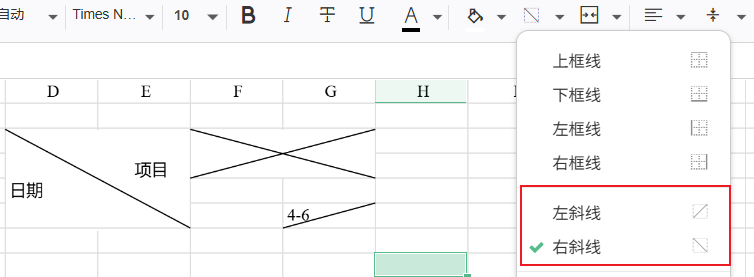

<p align="center">
  
</p>

<h1 align="center">Luckysheet CRDT</h1>

简体中文 | [English](./README.md)

`在线体验地址`: [https://luckysheet-crdt.netlify.app/](https://luckysheet-crdt.netlify.app/)

<p align="center">
  
</p>

---

## 项目分支

-   `master`: 稳定版，提供可选数据库服务，功能完整实现
-   `master-alpha`: 开发版，提供可选数据库服务，功能完整实现
-   `master-vue`: 稳定版，提供用户系统、文件系统，功能完整实现，依赖数据库服务

## 仓库地址

-   `Gitee`: [https://gitee.com/wfeng0/luckysheet-crdt](https://gitee.com/wfeng0/luckysheet-crdt)
-   `GitHub`: [https://github.com/pushu-wf/luckysheet-crdt](https://github.com/pushu-wf/luckysheet-crdt)

**⚠️ 温馨提示**

最新的特性始终在`Gitee`上先更新，并且以 `Gitee [master-alpha]`、`Gitee [master]`、`Github [master]`的顺序更新。

## 项目说明

1. 本项目基于 [Luckysheet](https://github.com/mengshukeji/Luckysheet) 源码修改，**请遵循原作者开源协议**，同时，**请不要删除或修改源码头部版权声明**
2. 本项目以 **Apache2.0 协议开源**，请放心使用，同时，本项目也将回馈于 Luckysheet 社区，丰富社区生态，再次感谢 @[Luckysheet](https://github.com/mengshukeji/Luckysheet) 团队 ❤️
3. 项目为 **Luckysheet 协同增强版（全功能实现）**，意在**提供协同实现思路、数据存储服务、协同演示**等
4. 项目支持 **可选数据库服务**，没有数据库的用户数据无法持久化存储，协同功能并不受影响，**⚠️ 仅对 `master`、`master-alpha` 分支有效，`master-vue` 依赖数据库功能实现用户系统**
5. 项目使用 **[Sequelize](https://www.sequelize.cn/)** 作为 ORM 数据服务技术，支持 MySQL、SQLite、PostgreSQL、MSSQL 等数据库，方便用户快速迁移
6. 项目使用 **Typescript** 作为主要开发语言，提供完整的类型提示，规范代码，提高开发效率。
7. 个人精力有限，**存在 BUG 及功能未完善之处**，请提交 [issue](https://gitee.com/wfeng0/luckysheet-crdt/issues/new)，我会及时处理
8. 也欢迎大家 fork 项目，提交 PR，一起完善项目

## 收费声明

为了更好地驱动开源发展，从 `2025-04-15` 的 `e12d2f4850127f53292a5161445fc500593176b9` 版本开始，**项目不再提供 Luckysheet 源码修改部分**。如您需要源码进行二次开发，请联系作者付费获取。

请注意，**Luckysheet-CRDT 前后台功能完全开源，不依赖源码即可正常使用所有协同编辑功能**,项目启动、运行、部署等环节均不需要源码。

源码主要用于二次开发场景下的功能拓展：

-   如果您仅使用现有的协同编辑功能，**无需获取源码**
-   如果您需要进行二次开发以满足特定需求，**请联系作者付费获取源码**

**服务详情**

-   **收费标准**：**`199 元`**
-   **服务内容**：仅提供源码包（不包含持续的功能升级、BUG 修复，也不等同于产品购买）
-   **联系方式**：QQ 群: `522121825`（推荐）| Email: `<1982392655@qq.com>`(推荐)

## 项目启动

1. 克隆项目：

```bash
git clone https://gitee.com/wfeng0/luckysheet-crdt
```

2. **下载依赖**：

```bash
# "dep-npm": "npm install --s && cd server && npm install --s",
# "dep-pnpm": "pnpm install --s && cd server && pnpm install --s"
npm run dep-npm | npm run dep-pnpm
# 推荐使用 pnpm 进行依赖的安装，避免出现版本冲突问题
```

**⛔️ 温馨提示**：

```js
1. 项目依赖分为前端依赖、后端依赖（独立的项目）；
2. 推荐大家使用 `pnpm install` 安装依赖，避免出现版本冲突问题；
3. 如果依赖下载报错，可以尝试删除 `package-lock.json` 文件，重新执行依赖安装；
4. 如果封装命令 `npm run dep-npm` 报错，请尝试执行 `npm install --s` 命令进行前端依赖安装，执行 `cd server && npm install --s` 命令进行后端依赖安装。

---

**如果还报错，请确认环境是否满足运行条件**：
`node -v ==> v20.x.x` // 请确保 node 版本大于 18
`npm -v ==> 10.x.x` // 请确保 npm 版本大于 7.x.x
```

3. 🚫<span style="color:red;font-weight:900">~~如果无数据库服务，请跳过此步骤~~</span>🚫 配置数据库参数：

```ts
// server/src/Config/index.ts
export const SQL_CONFIG = {
	port: 3306,
	host: "127.0.0.1", // localhost or 127.0.0.1
	database: "luckysheet_crdt",
	user: "root",
	password: "root",
};
```

4. 🚫<span style="color:red;font-weight:900">~~如果无数据库服务，请跳过此步骤~~</span>🚫 同步数据库表：

```bash
npm run db
```

**⛔️ 温馨提示**：

```ts
1. 请确保数据库配置正确可用
2. 请确保项目执行同步数据库命令 `npm run db`
3. 项目周期只需要执行一次，确保数据库内存在表结构即可。
```

5. 启动服务：
    - 前端服务：`npm run dev`
    - 后端服务：`npm run server`
6. 打开网址：`http://localhost:5000` | `http://localhost:9000` 即可体验协同功能。

## 项目部署

### 方式一：Docker 部署（推荐）🐳

**使用 Docker Compose 一键部署，无需手动配置环境和数据库！**

#### 1. 前提条件

- 已安装 Docker 20.10+
- 已安装 Docker Compose 2.0+

#### 2. 快速开始

**手动部署:**

```bash
# 1. 复制环境变量配置文件
cp env.example .env

# 2. 根据需要修改 .env 文件中的配置（可选）
# vim .env

# 3. 启动所有服务
docker-compose up -d

# 4. 查看服务状态
docker-compose ps

# 5. 查看日志
docker-compose logs -f
```

#### 3. 访问应用

- **应用地址**: http://localhost:9000
- **数据库地址**: localhost:3306

---

### 方式二：传统部署

**温馨提示：下列所有命令均在项目根目录下执行 /LUCKYSHEET-CRDT/**

1. **注意！** 请修改部署的配置文件：`src/config/index.ts`：

```ts
// 修改后台地址为 服务器IP地址
export const SERVER_URL = "http://localhost:9000";

// 修改协同地址为 服务器IP地址
export const WS_SERVER_URL = "ws://127.0.0.1:9000";
```

2. 先打包前端项目：`npm run build`

    - 请注意，打包文件文件，默认输出到 `server/public/dist`

3. 打包服务端代码：`npm run build:server`

    - 此时，整个项目的打包结果，会直接输出到 `server/wwwroot` 目录下，即可直接部署到服务器上。

4. 请将 `server/wwwroot` 目录下的文件，上传到服务器上
 <p align="center">
   
 </p>

5. 在服务器上安装 `node` 环境，相关教程可自行上网查询

    - 本例提供：[centos 参考此链接](https://blog.csdn.net/weixin_61367575/article/details/138012405)

6. 同步数据库表：`npm run db`

    - 请确保数据库配置正确可用（~~如果无数据库服务，请跳过此步骤~~）

7. 启动服务：`npm run start`：**此命令仅打包后 wwwroot 文件夹下有效** - 等待依赖下载完成，启动服务`npm run start`，部署完成后访问 `http://${ip}:9000` 即可访问

## 服务端口说明

1. 前端服务端口：`5000`
2. 后端服务端口：`9000`
3. 数据库服务端口：`3306`

```js
// 1️⃣ 后端服务端口配置：server/src/Config/index.ts
export const SERVER_PORT = 9000;
```

```js
// 2️⃣ 数据库服务端口配置：server/src/Config/index.ts
export const SQL_CONFIG = {
	port: 3306,
	// ... other config
};
```

```js
// 3️⃣ 前端服务端口配置：src/config/index.ts
// 导出后端服务地址
export const SERVER_URL = "http://localhost:9000";

// 导出协同服务地址
export const WS_SERVER_URL = "ws://127.0.0.1:9000";
```

## 源项目优化

### 1️⃣ 页面 UI 重构

<p align="center">
  
</p>

### 2️⃣ 图表协同

<span style="font-weight:900">左侧为 `vchart` 渲染，右侧为 `chartmix` 渲染</span>

<p align="center">
  
</p>

<span style="font-weight:900">vchart 图表动画更加流畅，页面简洁美观</span>

<p align="center">
  
</p>

<span style="font-weight:900">vchart 图表设置</span>

<p align="center">
  
</p>

<span style="font-weight:900">chartmix 图表数据联动</span>

<p align="center">
  
</p>

<span style="font-weight:900">vchart 图表数据联动</span>

<p align="center">
  
</p>

### 3️⃣ 新增左斜线|右斜线 边框类型

<p align="center">
  
</p>

### 4️⃣ 插件依赖优化

1. **源码中的插件注册方案**：

```js
plugins: [{ name: "chart" }, { name: "print" }];
```

<p align="center">
  
</p>

**这会导致一个问题，在线链接在网络问题、内网限制等其他因素下，导致插件依赖无法正常下载。**

2. **优化方案**：

```js
plugins: [
  {
    name: "chart",
    dependScripts: [
      "/lib/expendPlugins/libs/vue@2.6.11.min.js",
      "/lib/expendPlugins/libs/vuex.min.js",
      "/lib/expendPlugins/libs/elementui.min.js",
      "/lib/expendPlugins/libs/echarts.min.js",
      "/lib/expendPlugins/libs/chartmix.umd.min.js",
    ],
    dependLinks: ["/lib/expendPlugins/libs/element-ui.css", "/lib/expendPlugins/libs/chartmix.css"],
  },
  {
    name: "vchart",
    dependScripts: ["/lib/expendPlugins/libs/vchart.min.js"],
    dependLinks: ["/lib/expendPlugins/libs/vchart.css"],
  },
  {
    name: "fileImport",
    dependScripts: ["/lib/expendPlugins/libs/luckyexcel.umd.js"],
  },
  {
    name: "fileExport",
    dependScripts: ["/lib/expendPlugins/libs/exceljs.min.js", "/lib/expendPlugins/libs/fileSaver.min.js"],
  },
],
```

<p align="center">
  
</p>

**相关的插件依赖，相关的加载方案均封装好了，同时，还兼容在线方案**：

```ts
// 在线方案
plugins: [
  {
    name: "chart",
    dependScripts: [
      "https://unpkg.com/vue@2.6.11/dist/vue.min.js",
      // ...
    ],
  },
```

```ts
// 源码中的请求原理如下：
// 如果是 http 在线地址，直接请求
if (url.indexOf("http") == 0) {
	link.setAttribute("href", url);
} else link.setAttribute("href", window.location.origin + "/" + url);

// 如果是 http 在线地址 则直接请求
if (scripts[i].indexOf("http") === 0) {
	s[i].setAttribute("src", scripts[i]);
} else s[i].setAttribute("src", window.location.origin + "/" + scripts[i]);
```

### 5️⃣ 文件导入|文件导出

**文件导入**
<span style="font-weight:900">支持协同~</span>

<p align="center">
  
</p>
<span style="font-weight:900">配置方法：</span>

```js
// 1. 配置导入插件
const options = {
	// ...other config
	plugins: [{ name: "fileImport" }],
};

luckysheet.create(options);
```

<span style="font-weight:900">注意事项：</span>

1. 文件导入依赖于 `luckyexcel` 插件；
2. 故而有些功能受限于插件，如需拓展，请自行实现；
3. 请正确配置 `plugins: [{ name: "fileImport" }]` 后使用导入功能。

---

**文件导出**

<p align="center">
  
</p>
<span style="font-weight:900">配置方法：</span>

```js
// 1. 配置导出插件
const options = {
	// ...other config
	plugins: [{ name: "fileExport" }],
};

luckysheet.create(options);
```

<span style="font-weight:900">注意事项：</span>

1. 文件导入依赖于 `exceljs | file-saver` 插件；
2. 故而有些功能受限于插件，如需拓展，请自行实现；
3. 请正确配置 `plugins: [{ name: "fileExport" }]` 后使用导入功能。

### 6️⃣ 自定义菜单

<span style="font-weight:900">配置方法：</span>

<p align="center">
  
</p>

```ts
const options = {
   lang: "zh",
   title: "Luckysheet",
   // ...other config

   // 传入 menuHandler 配置项
   menuHandler:{
       hideDefaultMenu: string[], // 目前默认菜单为 导入导出 importFile | exportFile
       customs: MenuHandlerCustomsItem[]
   }
}

type MenuHandlerCustomsItem = {
  label: string
  value: string
  callback: () => void
  order?: string // 菜单排序，小的在上面，默认的菜单 order = 10 在默认菜单上面，需要比10小，不传默认放置在下面
  icon?: string
} |
// 分割线配置对象
{
  value: 'divider'
}
```

**示例**

```ts
menuHandler: {
	customs: [
		{
			label: "保存",
			value: "saveFile",
			order: 1,
		},
		{ value: "divider", order: 2 },
	];
}
```

**自定义菜单的 icon 图标处理方法**

1. 下载 iconfont 资源，放置到 `source/src/assets` 目录下（下载到本地并解压）
2. 在同级目录 `iconfont/iconfont.css` 引入当前下载的资源包

```css
@import url("../font_3944349_xxxxx/iconfont.css");
```

3. 打包输出即可正常使用 iconfont 图标

---

**显示 Logo**

<p align="center">
  
</p>

**隐藏 Logo**

<p align="center">
  
</p>

**配置方法**：

```js
const options = {
	showlogo: false,
	/// ...other config
};
```

### 7️⃣ 自定义请求头

很多人反映，应该在请求表格数据接口时，添加 cookies、token 等信息，以实现用户身份权限校验，目前已实现，具体配置如下：

```ts
const options = {
	// ... other config,
	// 添加请求头
	requestHeaders: {
		authorization: localForage.getItem("token"),
		"x-requested-with": "XMLHttpRequest",
		"custom-name": "custom-value",
		// ... other headers
	},
};
```

**具体实现方案：`源码/src/core.js`**

```ts
// 修改 $post 方法，改为 $ajax() 以实现添加请求头的功能
$.ajax({
	url: server.loadUrl,
	type: "POST",
	data: { gridKey: server.gridKey },
	beforeSend(xhr) {
		if (!extendsetting.requestHeaders) return;
		for (let key in extendsetting.requestHeaders) {
			xhr.setRequestHeader(key, extendsetting.requestHeaders[key]);
		}
	},
	timeout: 15000,
	success: function (d) {},
	error: function (error) {},
});
```

### 8️⃣ 打印相关

**新增打印 API**

```js
// "sheet": 打印当前工作表  "areas": 打印执行选区  "pages": 打印指定页码
// type : "sheet" | "areas" | "pages"
luckysheet.print(type, neetToPreview); // 如果不需要预览，则第二个参数为false
```

**打印模糊优化**

```js
const options = {
	/// ... other config,
	printDevicePixelRatio: 4, // 数值越大，打印越清晰，但绘制时间更长，请平衡性能
};
```

**打印支持取消网格线**

<p align="center">
  
</p>

**打印预览视图**

<p align="center">
  
</p>

**打印当前页**

<p align="center">
  
</p>

**打印单元格**

<p align="center">
  
</p>

**打印指定页码**

<p align="center">
  
</p>

**打印图片**

<p align="center">
  
</p>

**打印图表**

<p align="center">
  
</p>

### 9️⃣ 单元格图片`beta`

**新增单元格图片显示功能**

1. 支持插入浮动图片；
2. 支持插入单元格图片；
3. 支持浮动图片与单元格图片相互转换；
4. 支持配置默认图片展示模式 `config.imageMode = 'float' | 'cell'`；
5. 支持单元格图片预览；
6. 支持单元格图片合并自适应。

<p align="center">
  
</p>

### 🔟 自定义快捷键

**配置方法**：

```js
const options = {
	/// ... other config,
	// 自定义快捷键
	customShortcutKeys: [
		{
			key: number,
			ctrl?: boolean,
			shift?: boolean,
			alt?: boolean,
			callback: (e) => {},
		},
	],
};
```

### 其他源码优化

1. [#Fix 修复多人协同提示框显示异常](https://gitee.com/wfeng0/luckysheet-crdt/commit/af3c5837f8bec8a8cf4d261cbc8c9416d19902e1)
2. [#Fix 修复同用户 ID 刷新后光标无法实现协同](https://gitee.com/wfeng0/luckysheet-crdt/commit/5212b82c90595ff324c86db56e5ec25b88912d38)
3. [#Fix 修复公式链相关协同消息传递](https://gitee.com/wfeng0/luckysheet-crdt/commit/c121bcd389b4f8ecef00e3570cda9aea27e7333d)
4. [#Feat 批注导入实现、完善源码对批注的识别](https://gitee.com/wfeng0/luckysheet-crdt/commit/72e52419ce0168c352b0ed78e182832426b7bdda)
5. [#Feat 优化 chartmix/vchart 数据联动及实现 server 数据更新存储记录](https://gitee.com/wfeng0/luckysheet-crdt/commit/3f89fff92722ab1631c6c5976b307eb37f83f1d1)
6. [#Fix 紧急修复初始化 sheet 时，返回数据 celldata f ='' 时， formula 判断异常，导致双击清空数据](https://gitee.com/wfeng0/luckysheet-crdt/commit/09147f0c76cbd0c94b2e358d8045282f7dba165d)
7. [#Fix 修复删除列后撤销协同不更新 BUG](https://gitee.com/wfeng0/luckysheet-crdt/commit/232103c62df81e7cec3abd2b19e986d1ffad73d5)
8. [#Fix 修复 inlineStr 富文本数据复制粘贴异常 BUG](https://gitee.com/wfeng0/luckysheet-crdt/commit/33274ef5e1a7462b4c4670bbd700d1f1dcba53fa)

## Master-Vue 开箱即用版

本项目作为`luckysheet-crdt`的一个分支，附属于 `luckysheet-crdt`，仅作为 vue 版本的示例，提供完整的用户系统(登录、注册、修改信息)、文件系统(创建、修改、删除、协同、分享...)，项目截图如下：

<p align="center">
  
  
  
  
  
</p>

## 常见问题

1. **导入文件时，提示 `文件格式错误`**：

```ts
目前仅支持 xlsx 格式，请检查文件格式是否正确。
```

2. **页面显示`协同服务不可用，当前为普通模式`**：

```ts
try {
  const { data } = await fetch({
      url: "/api/getWorkerBook",
      method: "post",
      data: { gridKey },
   });
}
catch (error) {}

当且仅当！ fetch 请求失败时，会进入 catch 块，
此时会提示 `协同服务不可用，当前为普通模式`；
请检查服务是否正常，一般有下列可能：

1. 服务异常
2. 数据库异常
3. 数据库表结构异常
```

3. **数据库数据混乱**：

```ts
造成该原因的唯一可能，就是应用没有相关的 delete 语句，
不是我不写哈，而是大家根据自己的实际业务，进行拓展。
下列步骤可恢复：
1. 删除 luckysheet_crdt 所有数据表;
2. 执行 npm run db 同步数据库表;
3. 执行 npm run server 启动服务;

上诉操作，会自己创建数据库表，同步最新的模型结构，
并且创建一个 gridkey-demo 的 workerbooks、workersheets 记录；
当且仅当，这两个表有记录的场景下，才能渲染 luckysheet；

注意！如果两个表没有一条记录，也可能造成无法协同（问题2）
注意！如果 workersheets 表有记录，但是 deleteFlag 为 true 的情况下，也会导致无法渲染 luckysheet；
```

4. **自定义创建图表类型**
   目前 vchart 创建图表是随机的`饼图`|`折线图`，如果想实现自定义的图表类型传递，需要修改 chartmix 相关源码，具体步骤可参考如下：

<p align="center">
  
</p>

```ts
1. 下载源码：https://gitee.com/mengshukeji/chartMix
2. 修改 src/utils/exportUtil.js createChart 方法，添加图表类型参数
3. 重新打包，将文件放置到项目中
```

## 开源贡献

1. 提交 [issue](https://gitee.com/wfeng0/luckysheet-crdt/issues/new)
2. fork 本项目，提交 PR
3. 加入交流群：
 <p align="center">
   
 </p>
